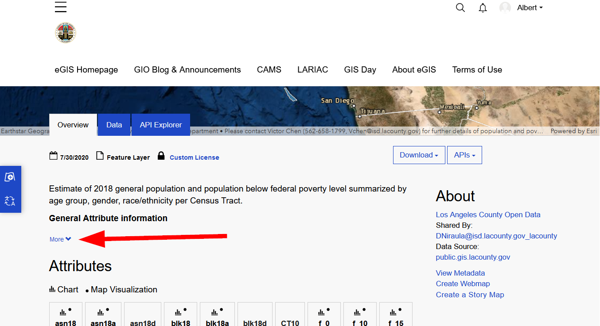
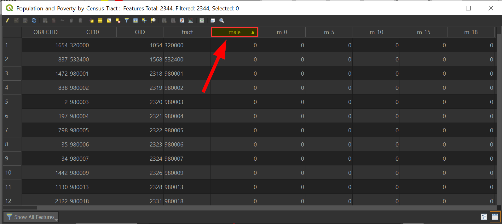
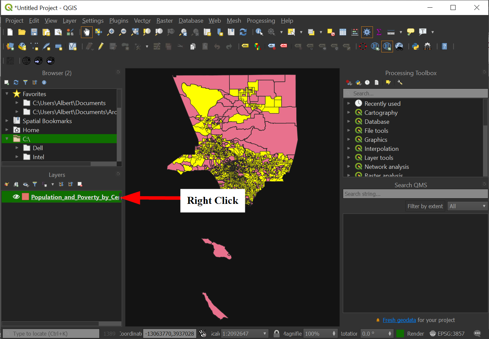
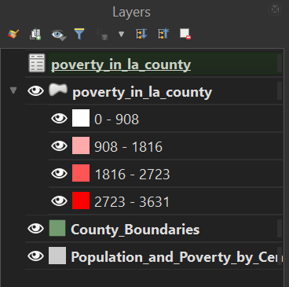
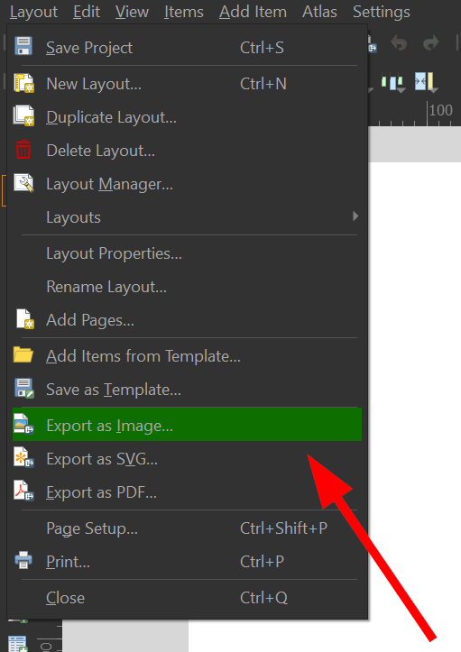

Introduction to GIS for the Social Sciences
===========================================

This tutorial uses QGIS 3 to teach the basics of desktop GIS for the
Social Sciences, with an emphasis on acquiring census data, mapping
census tracts, and generating a map.

Workshop Preparation
--------------------

You should download and install [QGIS version
3.14](https://qgis.org/en/site/forusers/download.html) or higher to your
computer.

The datasets for the workshop are available in this [data folder](/data/).

Download all the files and extract them.

Workshop Aims
-------------

This beginner-level workshop will focus upon the fundamental concepts
and skills needed to use Geographic Information Systems (GIS) software
for the exploration and analysis of U.S. Census datasets with spatial
attributes using the QGIS platform.

No prior experience QGIS or other GIS software is required.

By the end of this workshop, you will be able to:

-   Define basic GIS geospatial concepts and terminology.

-   Know the about different type of data sets

-   Understand where to find Census data on the web

-   Know how to add data to a QGIS project

-   Find the attributes of your data in QGIS

-   Perform basic selections and queries in QGIS

-   Stylize a map using different data types in QGIS

-   Export a map in QGIS

Introduction to GIS
===================

What is GIS? Depending on who you ask, GIS has two meanings:

Geographic Information System typically refers to applications and
software that is used to create spatial data and to investigate spatial
relationships between that data.

Geographic Information Science is the framework we use to ask questions
about the spatial relationship between data.

For example, predicting the effects of climate change (rising
sea-levels) on low laying areas (elevation) would be an application of
Geographic Information Science, while the software to do the predictions
would be an example of a Geographic Information System.

In short:

Data Types
----------

There are two key distinction between data types, spatial or non-spatial
data.

Spatial data is data that already contains geographic information.

Common file types are the following:

-   **Shapefiles:** .zip (these are made up of 5 files, and the .shp is
    commonly used to identify them)

-   **KML files:** .kml, .kmz

-   **GeoJSON files:** .geojson

-   **JPG files**: .jpg\*

Non-spatial data is data that has no geographic information.

Common non-spatial data are the following:

-   **Excel Spreadsheets**: .xlsx, .xls

-   **Comma/Table Separated Value files**: .csv, .tsv

-   **JSON files**: .json

-   **dBase database file**: .dbf

When non-spatial data has geographic attributes, like zipcodes,
addresses, city names, or even latitude/longitude coordinates it can be
turned into spatial data. The distinction is that non-spatial data will
only show up as tables in GIS applications.

On the other hand, spatial data that has data attributes can be turned
into a non-spatial data type by saving/exporting its data as tables. The
following graphic summarizes this relationship:

Spatial Data Formats
--------------------

There are several data spatial data models that you may encounter as you
work with geo data. Geodata formats are commonly divided into two types,
vector data or a raster data. In GIS, discrete data means that the data
has a fixed location. Continuous data in GIS does not have well defined
or no boundary at all, the most common example is elevation. The graphic
below shows how vector data and raster data formats can represent
continuous or discrete data:

Spatial Data Types (Source: Michele Tobias, UC Davis)

The graphic also illustrates how certain vector data is often better
suited for discrete data, while raster data is often better used for
continuous data. Let's go into a little more detail about each!

### Vector Data

Vector data represents discrete objects in the real world with points,
lines, and polygons in the dataset.

If you were to draw a map to your house for a friend, you would
typically use vector data - roads would be lines, a shopping center
included as an important landmark might be a rectangle of sorts, and
your house might be a point (perhaps represented by a star or a house
icon).

### Raster Data

Raster data represents continuous fields or discrete objects on a grid,
storing measurements or category names in each cell of the grid.

Digital photos are raster data you are already familiar with. If you
zoom in far enough on a digital photo, you\'ll see that photo is made up
of pixels, which appear as colored squares. Pixels are cells in a
regular grid and each contains the digital code that corresponds to the
color that should be displayed there.

You may be surprised to see jpgs listed as a data type that you may have
thought to be non-spatial, but satellite imagery is commonly stored in
photo formats.

Introduction to GIS for the Social Sciences
-------------------------------------------

Now that we have a good understanding of geospatial data, we can explore
the GIS connection to the social sciences.

Geography is divided into physical geography (natural systems) and human
geography (human-made systems). The social sciences sit within
human-made systems and the data here is often captured in specific
units. Such as number of people living in a specific city or the
language spoken in a country. Thusly, most of the data we will encounter
will be discrete.

Another common example is the following election result map which shows
the number of people from each state that voted for either Clinton or
Trump in the 2016 general election.

Source: [New York Times,
2016](https://www.nytimes.com/elections/2016/results/president)

The states themselves are the boundaries, even though the data is
collected at smaller levels.

How is that possible? The answer is geographical hierarchy.

### 

### Geographic Hierarchy

Move over Aristotle: The **sum** is the whole of its parts!

The first law of Geography (and perhaps only) is "**everything is
related to everything else, but nearer things are more related than
distant things.**" When thinking about human data, there are many
different units, countries, states, cities, and even households.
Whenever this data is being summarized to larger geographies, as long as
the smaller boundaries do not overlap then you can do so. However, this
does not mean it is always safe to do so, why?

Keeping the first law of geography in mind, when you summarize smaller
data to larger geographies (i.e. going from cities to a state), the
nearer things become less related because they are summarized to a
larger geographic relation. Let's return to the election map above, but
break it down into counties to see how the summing of the data changed
spatial relationships.

How does this map compare to the previous map?

For one thing, you can see that a state like Arizona is not completely
red and has quite a bit of democratic voters. This is possible, because
the geographic hierarchy is preserved when the data from the counties is
summarized to the state level.

Below is an example of how the United States Census Bureau has developed
a hierarchal geography:

The Federal Information Processing Standards (FIPS) codes represents
this in numerical format:

\[STATE\] + \[COUNTY\] + \[CENSUS TRACT\] + \[CENSUS BLOCK GROUP\]\
For example:\
06 + 037 + 2653 + 01 or 06037265301, which is UCLA's census tract.

When data is organized in this way it can readily summarized, since the
smaller units make up the larger units. For example, demographic
information that is collected at the smaller Census Tract level can be
easily aggregated to answer questions at the city or state level.
Questions such as "how many Asians are there in California?" are readily
answerable. But the voting data that was collected at the voting
precinct level, the summarization could occur at the state level because
all the units fell within a particular state and it did not overlap. If
you were to combine the voting data with a bigger geography that causes
boundaries to overlap, then data will be double counted and will cause
problems (and headaches!)

What other ways could voter data be summarized to?

Voting data can also be summarized at the county level, since counties
do not overlap and these are still bigger than the precincts. When
trying to aggregate data to the census tracts a major problem occurs,
some precincts will overlap with many different census tracts! A special
type of analysis, called a "weighted-merge" will need to be done in
order to distribute the votes across census tracts accurately.

Now that we have a better understanding of geospatial datasets, how it
relates to the social sciences, and some of the problems associated with
them, we can finally start to utilize spatial data.

Finding data
------------

In this workshop, we will be answering the following question:

Research Question: Which areas in Los Angeles have more than 25% of
their population living in poverty?

We will be using the following data:

-   Los Angeles 2010 Census Tracts

-   County Boundaries

We are using the Census Tracts because those are how demographic data is
collected in the United States.

Data for mapping in the social sciences will commonly be found as
standalone tables or vector data, and the best way to find these data is
from authoritative sources, like the government, news organizations, and
research groups.

One good resource is <https://censusreporter.org>

Getting down with geodata hubs
------------------------------

Geodata portals are other places where spatial data sets can be found.
The Los Angeles County operates a geodata portal that uses the ESRI
Geohub tool, and we will navigate to it below:

<https://egis-lacounty.hub.arcgis.com/>

1.  Click the search box and type in "**Population Census Tract**"

    

2.  Click on "**Population and Poverty by Census Tract**"

    

3.  Before downloading anything, we should check the see if this data is
    worth it, so click on "More" under "General Attribute Information"

    

4.  Scroll down to see the table that says, "**population below federal
    poverty level**"

    

5.  Perfect, the data we need is in here:

    1.  **male18a** is the total male population 100% below the Federal
        Poverty Level

    2.  **female18a** is the total female population100% below the
        Federal Poverty Level.

6.  Scroll down the page and find and click "**Download**"

    

Pop-quiz! Which file types are spatial and which are not?

7.  Download the shapefile:

    

8.  Extract the zip file.

    

9.  You should now have a new folder containing the following files:

    

**Exercise \#1**

Find and download the County Boundary Layer.

Hint: Search "Boundary"

If you get stuck, feel free to download all of required data from this
[Box Folder
Online](https://ucla.box.com/s/98xzkv5rj5fcszn5blhi5vbsrtwwlj2z).

Start QGIS & Open a New Project
===============================

10. Start QGIS in the way you typically open any program on your
    particular computer\'s operating system.

11. Click on the "New file" on the top right corner to start a new
    project.

    

12. Let's get acquainted with the default layout of QGIS:

    3.  **Map panel**: Where the layers for the map will be displayed

    4.  **Layers panel**: Where the layers can be reorganized and
        modified

    5.  **Toolbar**: Where you can quickly change tools to interact with
        the map

    6.  **Processing Panel**: Advanced tools for interacting with layers

        

13. Add the downloaded data set by going to the Toolbar and then
    "Layer" \>\> "Add Vector Data":

    

14. Click on the "..." to browse for the shapefile that we downloaded:

    

15. Locate the file and click "**Open**".

16. Click "**Add**"

    

17. Notice that the dataset was added to the Layer Panel and then Map
    Panel at the same time:

    

### Attribute Tables: Taking a closer look at our data

The value of GIS data is that it has various information connected to
it. We can examine and interrogate this data by opening the layer's
"**Attribute Table**."

18. Let's check what data we have by right clicking on the layer:

    

19. Go to "**Open Attribute Table**" to open the data:

    

20. A window should open up with the data in columns and rows:

    

21. The "green" box is the location of our cursor in the data and is
    useful to find where we are in our data set:

    

Let's answer the following.

Spatial Question \#1:

What are the Top 10 Census Tracts with males in Los Angeles County?

22. We can quickly sort the rows by the column by clicking on them, so
    for our query, we will click on "male":

    

    Notice how an arrow appears and the data begins at 0 now.

23. Click "**male**" once again to sort by descending:

    

24. Your data table should look like the following with the arrow facing
    downwards:

    

25. Click on the "1" to highlight that feature:

    

26. Check the map to see what happened:

    

    Census tracts are small, so they are pretty hard to see, especially
    with these outlines! Don't worry though, we'll get to making the map
    prettier later. For now, let's return to answering our spatial
    query!

27. Let's go back to our table and from the "1" on the left, that down
    to "10", this effectively answers our question:

    

28. Check the map to see what happened:

    

29. Notice that the selection of the data has also appeared on the map
    as yellow highlights:

    

30. While this method of filtering is quick, it does have drawbacks
    because requires scrolling through the data set.

31. Clear our current selection by clicking on the "**Clear Selection**"
    button:

    

### Creating Fields

Returning to our research question, "which census tracts have more than
25% of the population living in poverty," the fields that we need for
our analysis do not exist, so we have to create them!

Since, our data set only has male and female population, we can add
those up to create the total population. The same applies for the
population in poverty, too. In order to generate these fields, we will
need to create those fields using the "**Field Calculator**". To create
the "**total population**" field we need to add the **male** and
**female** fields, to create the "total population under the 100%
Federal Poverty Line" field we will need to add **male18a** and
**female18a**.

32. Since we are going to be editing our data, we need to toggle editing
    mode by clicking on the **pencil** icon:

    

33. Click on "**Field Calculator**"

    

34. Create a new field with the following:

    7.  **Output field name**: TOTAL\_POP

    8.  **Output field type**: "Whole number (integer)"

    9.  **Expression**: "**male**" + "**female**"

> 
>
> To avoid misspelling, you can type "**male**" in the search on the
> right and it will filter the fields for you, this will allow you to
> double click on the field to add into the expression:
>
> 

35. When your fields look like the following, click on "**OK**" to
    create the field:

    

36. Let's add the next field called **POVERTY\_POP**, which will be the
    combination of **male18a** and **female18a**:

    10. **Output field name**: POVERTYPOP

    11. **Output field type**: "Whole number (integer)

    12. **Expression**: **"male18a"** + **"female18a"**

Recall that **male18a** and **female18a** are stated from the Los
Angeles Geohub as " Population 100% Federal Poverty Level"

The last field we will calculate is the proportion of the population
that is under poverty line which is the number of people in poverty
(**POVERTYPOP**) divided by the total population (**TOTAL\_POP**). The
field will be called, **POVERTY\_RA**, for poverty ratio.

37. The "**Field Calculation**" should look like the following:

    13. **Output field name**: POVERTY\_RA

    14. **Output field type**: "Decimal number (real)"

    15. **Expression**: "**POVERTYPOP**" / "**TOTAL\_POP**"

38. Now that we have our fields ready, let's filter out Census Tracts
    with no population.

39. Rather than do a quick sort, locate the toolbar, and click on the
    filter button:

    

40. Scroll down to the total population field we calculated,
    "**TOTAL\_POP**"

41. Click on "**Exclude Field**" next to "**TOTAL\_POP**":

    

42. Change it to "**Greater than**":

    

43. Next to "TOTAL\_POP", enter "**0**":

    

44. Scroll to the bottom of the window and choose "**Select Features**"

    

45. Select the table icon to return to the table view:

    

46. Notice that the "Selected" on the top has changed to reflect the
    number of records selected:

    

47. You can view only selected records by clicking on the lower right
    and going to "**Selected Records"**.

    16. 

    17. 

    18. 

    19. Save our edits by clicking on the disk icon:

        

    20. Stop editing by clicking on the pencil icon:

        

Saving datasets
---------------

We can save the records we selected! In doing so, we can save it as a
shapefile (a spatial data type) or as a CSV file (a non-spatial dataset)
that we can use in other software.

### Exporting a Shapefile:

48. With the records still selected, right click on the
    "**Population\_and\_Poverty\_by\_Census\_Tract**" layer:

    

49. Click on "**Save Selected Data Set as...**"

    

50. Choose the "**ESRI Shapefile**" format:

    

51. For File name, be sure to click on the **"..."** and save your file
    in an accessible location.

    

52. Click on "**Select fields to export and their export options**"

    

53. Click on "**Deselect all**" so no columns are selected:

    

54. All the checkmarks to the left should disappear:

    

55. Now click the small box to the right of the fields to "check" them
    for exporting.

    21. Check "**tract**" to keep that field:

        

    22. Check "**TOTAL\_POP**", "**POVERTYPOP**", and "**POVERTY\_RA**"
        to keep these fields:

        

56. When complete, click on "**OK**" to save the file:

    

### Exporting a CSV file

Non-GIS programs will have a hard time working with shapefiles, and the
most basic data file is a text file, so we should also know how to save
files as a CSV!

57. Right click on the new layer we created,
    "**poverty\_in\_la\_county**".

    

58. Go to "**Export**" \>\> "**Save Features As..**"

    

59. For Format, choose "**Comma Separated Value \[CSV\]**":

    

60. Save the file in an accessible location and click "OK":

    

61. Your "**Layers**" panel should look like the following:

    

62. Great! Now we know how to save a spatial and non-spatial file type!

63. We can open the attribute for both files in our data layers, and
    doing so for the "**poverty \_in\_la\_county**" gives the following
    window:

    

### Symbolizing our map

Now that we can export our layers and trim out extra fields, this makes
working with large and complicated data sets a little more manageable
when we are deciding to style our map! Imagine having to constantly
scroll through a list of 20 fields each time you want to change how your
map looks!

64. Right click on "**poverty\_in\_los\_angeles\_county**", and go to
    "**Properties**":

    

65. On the navigation panel in the properties window, click on
    "**Symbology**"

    

66. Click on the "**Simple Fill**" to open more options:

    

67. Click on "**Fill Color**" to open a color picker:

    

68. Under "HTML notation" put the following "**\#2774AE**":

    

69. Click "**Ok**"

    

70. Outlines are not very helpful when we are zoomed out and have many
    small features, so we will remove them, by clicking "**Stroke
    Style**" and then choosing "**No Pen**":

    

71. Click "OK" to apply the changes to the map:

    

72. The map should like something like this:

> 

Exercise \#2

Let's apply what we learned and change the symbology of the bottom
layer.

If your map looks the like following, great! I opted to show places with
no people as "white".

You successfully were able to apply what we just learned! Our map shows
us places where there are people living in Los Angeles County, but we
can do more and show what the distribution looks like by applying a
colored scale on our maps (also known as a choropleth).

### Advanced Symbology -- A tale of two data types and maps

Choropleth maps vs. Categorical maps

A **choropleth map** uses a colored ramp to style to map, typically
having different shades of one color and only works for data that is
numerical. A **categorical map** uses categorical data, often stored as
text fields, to style a map. A categorical map has vastly different
colors for values, and not shades of one color. This is because
categorical data, like name, language spoken, religion, etc. does not
have a numerical association. For example, if someone were to ask you,
"what is the average, median, and mode of city name" and map it, you
would most likely be confused. You could try to convert the categorical
data and get a count of "city names", but to actually treat city name as
a number, is not possible. Similarly, GIS software does not even allow
you to select Text (string) fields when using the graduated
symbolization option.

### Creating our first Choropleth

We will start our choropleth exercise by mapping the distribution of
poverty in Los Angeles County in census tracts.

73. Go back to the "Symbology" setting, by going to
    "**Properties**" \>\> "**Symbology**"

74. Click the dropdown where it says, "**Single Symbol**" and choose
    "**Graduated**":

    

    

75. Under "**Value**", click the dropdown arrow and choose
    "**POVERTYPOP**":

    

    

76. Nothing has changed yet, so click on "**Classify**":

    

77. By clicking classify, we classified the numerical data based on the
    statistical mode shown here:

    

You can click on histogram to get a better sense of how the data looks
in order to choose a more appropriate classification mode, but for now
let's draw our attention to the number of classes, which is 5. With a
graduate color scheme, each class gets its own color and so, it is not
usually a good idea to go higher than 5.

78. Go to "**Classes**" near the right side:

    

79. My preference is to stick with 4, which draws more attention darker
    and lighter areas better.

    

80. Side note: you can change the color ramp, by clicking on it:

    

81. When editing the color ramp, you can choose the two colors that make
    up the ramp, and here is some basic advice in doing so:

    -   Stick with one primary color if you are showing data that
        doesn't have negative values, like poverty.

    -   Choose two different primary colors if what you are showing does
        have negative values, like population growth.

    -   The more classes you choose, the harder it will be to
        distinguish them from each other.

    -   Pay attention to color blindness! A good website to help with
        choose a color-blind friendly color scheme is:
        <https://gka.github.io/palettes/>

82. Click "**OK**" and our map should look like the following:

    

83. What happened? Our map now has more details about where poverty is
    concentrated in Los Angeles County.

To get a sense as to how drastic the statistical methods affect the map,
let's change the data to "equal interval" and see what happens:

Exercise \#3

Use the "equal Interval" classification method to map the data

The resulting map should look like the following:

### Mapping Categorical Data

Now we will turn our attention to the **County\_Boundaries-shp** zip we
downloaded earlier!

84. Outside of QGIS, unzip the "**County\_Boundaries-shp**" file

85. Return to QGIS, and add the "**County\_Boundaries.shp**" as a vector
    layer to our project.

86. Your layers should look like the following:

    

87. Drag "**County\_Boundaries**" below the "poverty layer" so that the
    larger counties do not cover all of our data.

    

88. Right click on the "**County\_Boundaries**" layer to go to
    "**Properties**"

89. Click on "**Symbolize**" and this time, switch from "**Simple
    Fill**" to "**Categorized**"

    

90. Click "**Value**":

    

91. Choose the field "**Type**":

    

92. Click "**Classify**"

    

93. Notice how the colors are randomized:

    

94. Click "**OK**" to apply the changes to the map and it should look
    like the following:

    

95. The purple is a bit jarring, let's quickly change the color by right
    clicking on it in the layers panel:

    

96. The color wheel should show up:

    

97. Congratulations! You've successfully completed a categorical map!

> Feel free to change the color for the "**Other County**" as well. When
> choosing colors, it is important to bear in mind that a map with no
> visual hierarchy will be hard to understand. Visual hierarchy is the
> concept that important things are easier to see than less important
> things. Take for example these two versions of the map we just made:

One example of poor visual hierarchy is when the background map has more
vibrance than the main focus of the map, such as the one on the left
side.

Final Exercise!!

The time has come to put our skills to the test and answer our initial
research question. Return to the "**poverty\_in\_los\_angeles\_county**"
layer and use the "**POVERTY\_RA**" field to see the ratio of poverty to
people in Los Angeles.

### Working with multiple layers:

If you like the map you currently have, you can duplicate the layer and
hide it while you work on another one, by right clicking on the layer
and choosing duplicate.

The copied layer will automatically be hidden, so click the "eye" icon
to unhide it, the same functionality of hiding and unhiding works on all
map layers.

### Exercise Answer:

-   Filter "POVERTY\_RA" to be "Greater than or equal to" .25

-   Export those selected values

-   Symbolize the values using graduated color scheme and the
    "POVERTY\_RA" field.

If the field has been successfully changed, then we should be able to
see which areas in Los Angeles County have more than 25% of people
living under the Federal Poverty Line:

Exporting a map
---------------

Now that you have a map you are proud of, the time has come to open up
the "Print Layout" which is the QGIS way of styling the map with text,
legends, and other cartographic goodness.

98. Go to the "**Toolbar**" \>\> "**Project**" \>\> "**New Print
    Layout**"

    

99. Give a name for your layout in the new window, "**Los Angeles
    Poverty**"

    

100. Another window will appear, and since we are mainly authoring a
    map, let's add that first by clicking the "Add Map" button on the
    right side:
    

101. Click and drag to add the map to the print layout:

102. Click the "Text" button to add some text that will serve as our
    title:

103. Click and drag to add it to our canvas:

104. Click on "Lorem ipsum":

105. Click on "Item Properties":

106. Change the text under "Main Properties":

   Our title will be, "**Areas in Los Angeles with 25% of the
    population living below the Federal Poverty Rate, 2018**"

107. Under "**Appearance**" scroll or click the arrow to change the font
    size: 

108. Change the horizontal alignment to "center": 

109. Click the "**Add Legend**" button on the left:

110. Drag and to add a legend:

111. The legend should look like the following: 

112. You can fine tune the legend by clicking on the "Item" and then going to "Item Properties" 

113. Scroll down to the box and uncheck "**Auto update**" to get more
    control: 

114. Click on the layer name "**poverty\_in\_la\_county\_over\_25**" and
    rename it to: "**Census Tracts with more than 25% of living in
    poverty**" 

115. With the legend complete, you are ready to export the map!

116. Click on "**Layout**" \>\> "**Export as Image**": 

117. Choose a location for your map and click save.

118. Close the layout editor and save your QGIS project by going to
    "**Project**" \>\> "**Save** **As..**" 

119. Congratulations! You have completed your first mapping project in
    QGIS!
